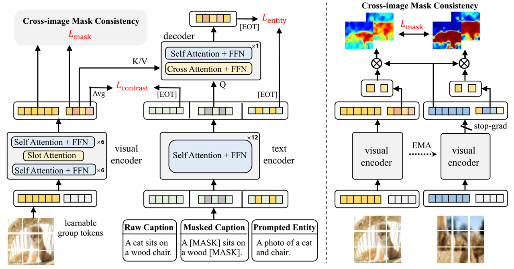

# Learning Open-Vocabulary Semantic Segmentation Models From Natural Language Supervision

This repository is the official implementation of [Learning Open-Vocabulary Semantic Segmentation Models From Natural Language Supervision](https://arxiv.org/abs/2301.09121) at CVPR 2023. Our transformer-based model, termed as OVSegmentor, is pre-trained on image-text pairs without using any mask annotations. After training, it can segment objects of arbitrary categories via zero-shot transfer. 


<div align="center">

</div>

## Prepare environment
Please refer to [docs/ENV_README.md](./docs/ENV_README.md)

## Prepare datasets
Please refer to [docs/DATA_README.md](./docs/DATA_README.md)

## Prepare model
Please refer to [docs/MODEL_README.md](./docs/MODEL_README.md)

## Demo 
To directly use the model for open-vocab segmentation: 

(1) Download the [pretrained model](https://drive.google.com/file/d/10F3b3FNzPdDx8LuKdjc1BzbSLMrPLvnc/view?usp=share_link). 

(2) Prepare your images, place them in the same folder, for example, 
```
- OVSegmentor
  - visualization
    - input
      - 1.jpg
      - 2.jpg
      ...
    - output
```
(3) Option1 --- Perform segmentation using the vocabulary of existing classes (e.g. voc/coco/ade), simply run:
```
python -u -m main_demo
    --cfg configs/test_voc12.yml \
    --resume /path/to/the/pretrained_checkpoint.pth \
    --vis input_pred_label \  
    --vocab voc \
    --image_folder ./visualization/input/ \
    --output_folder ./visualization/output/ \
```

(3) Option2 --- Perform segmentation using the custom classes
```
python -u -m main_demo
    --cfg configs/test_voc12.yml \
    --resume /path/to/the/pretrained_checkpoint.pth \
    --vis input_pred_label \  
    --vocab cat dog train bus \ ### list your open-vocabulary classes here
    --image_folder ./visualization/input/ \
    --output_folder ./visualization/output/ \
```

You can also save the segmentation masks (e.g. for evaluation) by running
```
python -u -m main_demo
    --cfg configs/test_voc12.yml \
    --resume /path/to/the/pretrained_checkpoint.pth \
    --vis mask \  
    --vocab voc \
    --image_folder ./visualization/input/ \
    --output_folder ./visualization/output/ \
```

## Training
To train the model(s) in the paper, we separate the training process as a two-stage pipeline. The first stage is a 30-epoch training with image-caption contrastive loss and masked entity completion loss, and the second-stage 10-epoch training further adds the cross-image mask consistency loss. 

For the first stage training on a single node with 8 A100 (80G) GPUs, we recommand to use slurm script to enable training:

```
./scripts/run_slurm.sh
```
Or simply use torch.distributed.launch as:

```
./scripts/run.sh
```

Stage-2 training: change the 1st stage checkpoint in the [2nd stage config file](./configs/ovsegmentor/ovsegmentor_pretrain_vit_bert_stage2.yml). We also provide our pre-trained 1st stage checkpoint from [here](https://drive.google.com/file/d/19Kpeh5iTgGSr5mzf4n0j5hqxGDgG-Wxi/view?usp=share_link).
```
stage1_checkpoint: /path/to/your/stage1_best_miou.pth
```

Then, perform the second stage training. 
```
./scripts/run_slurm_stage2.sh
```

## Evaluation

To evaluate the model on PASCAL VOC, please specify the resume checkpoint path in tools/test_voc12.sh, and run:

```
./scripts/test_voc12.sh
```
For PASCAL Context, COCO Object, and ADE20K, please refer to ./scripts/.

The performance may vary 3%~4% due to different cross-image sampling. 

## Model Zoo

The pre-trained models can be downloaded from here:

| Model name  | Visual enc | Text enc      | Group tokens  | PASCAL VOC  | PASCAL Context | COCO Object | ADE20K | Checkpoint |
| ------------------ |------------------ |------------------ |---------------- | -------------- | -------------- | -------------- | -------------- | -------------- |
| OVSegmentor    | ViT-B|  BERT-Base|   8         |      53.8 |20.4       |  25.1         |      5.6       |    [download](https://drive.google.com/file/d/10F3b3FNzPdDx8LuKdjc1BzbSLMrPLvnc/view?usp=share_link)       |
| OVSegmentor |ViT-S | Roberta-Base   |     8         |     44.5| 18.3       | 19.0         |      4.3       |   [download](https://drive.google.com/file/d/10F3b3FNzPdDx8LuKdjc1BzbSLMrPLvnc/view?usp=share_link)      |
| OVSegmentor    | ViT-B|  BERT-Base|   16         |      Todo | Todo       | Todo         |      Todo       |   Todo       |

## Citation
If this work is helpful for your research, please consider citing us.
```
@inproceedings{xu2023learning,
  title={Learning open-vocabulary semantic segmentation models from natural language supervision},
  author={Xu, Jilan and Hou, Junlin and Zhang, Yuejie and Feng, Rui and Wang, Yi and Qiao, Yu and Xie, Weidi},
  booktitle={Proceedings of the IEEE/CVF Conference on Computer Vision and Pattern Recognition},
  pages={2935--2944},
  year={2023}
}
```

## Acknowledgements
This project is built upon [GroupViT](https://github.com/NVlabs/GroupViT). Thanks to the contributors of the great codebase.
